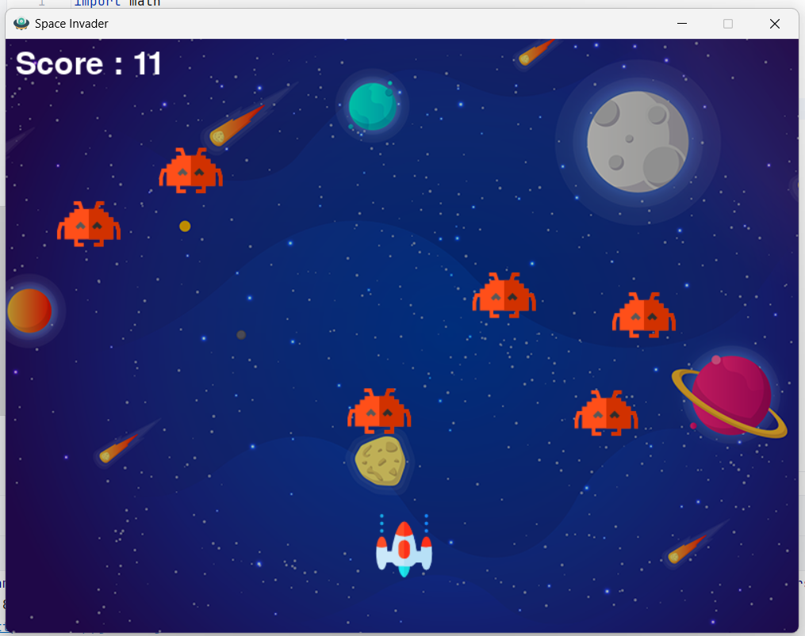

# 🚀 Space Invaders – Pygame Edition

A fun and classic **2D Space Shooter** game built with Python and Pygame! Battle waves of alien invaders, shoot them down, and achieve the highest score.

---

## 🎮 Game Preview

 <!-- Replace with an actual image if available -->

---

## 🛠️ Features

- Classic arcade-style Space Invader gameplay
- Multiple enemies moving in waves
- Bullet mechanics with collision detection
- Sound effects for shooting and explosions
- Real-time score tracking
- Custom graphics and background music

---

## 📁 Project Structure


---

## 🧩 Requirements

- Python 3.x
- Pygame

Install the required package:

```bash
pip install pygame
```


---
## 🚀 How to Play
Clone or download the repository.

Make sure all required assets (.png and .wav files) are in the same directory as Space_Invaders.py.

Run the game:

```bash
python Space_Invaders.py
```
Controls
← / → : Move the player spaceship

Spacebar : Fire bullet

Q or window close : Quit game

---

## 💥 Gameplay Mechanics
Player Movement: Smooth horizontal movement across the screen bottom.

Enemy Movement: Enemies move left and right and descend when reaching screen edges.

Bullet: Only one bullet can be fired at a time (when it's in "ready" state).

Collision Detection: When a bullet hits an enemy, an explosion sound plays and the enemy respawns at a new location.

Score: Each enemy hit increases your score.

## 🎨 Assets
All game assets (images and sounds) must be available in the root directory:

player.png — Player spaceship

enemy.png — Alien spaceship

bullet.png — Projectile

background.png — Game backdrop

background.wav — Background music (optional)

laser.wav — Bullet firing sound

explosion.wav — Explosion effect

## 📝 Notes
Background music is currently commented out. You can enable it by uncommenting:

```python
# mixer.music.play(-1)
```
The game currently supports a single bullet at a time. You can extend it for multiple bullets for advanced gameplay.

## 📄 License
This project is open-source and free to use under the MIT License.

## 🙌 Acknowledgements
Inspired by classic arcade games and beginner Python game tutorials from the Pygame community.